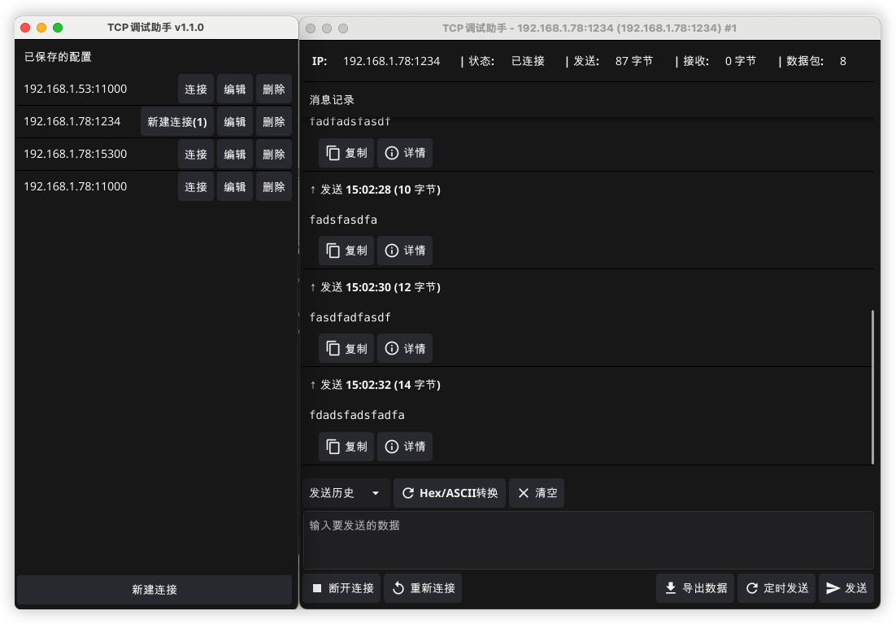
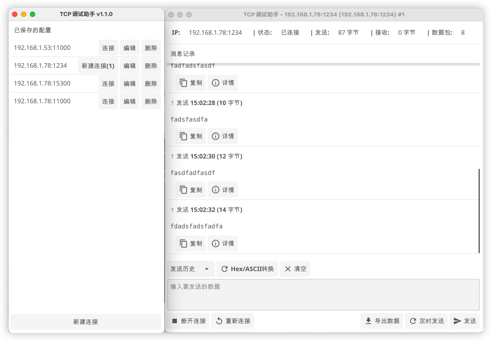

# TCP调试助手 (TCP Debug Assistant)

## 简介

TCP调试助手是一款功能强大的网络调试工具，专为网络工程师、嵌入式开发人员和测试工程师设计。它提供了友好的界面，帮助用户快速建立TCP连接、发送和接收数据包，并以多种格式查看数据。支持Windows、macOS和Linux多平台使用。

## 主要功能

- **多连接管理**：创建和管理多个TCP客户端和服务器连接
- **多种数据格式**：支持HEX（十六进制）、ASCII、二进制格式数据的发送和接收
- **数据可视化**：清晰直观地显示发送和接收的数据包
- **定时发送**：配置自动定时发送功能
- **数据导出**：将收发的数据包导出为文件
- **主题切换**：支持亮色和暗色主题
- **跨平台兼容**：适用于Windows、macOS和Linux系统

## 软件界面

### 主界面

**主界面左侧**显示已保存的连接配置列表，每个配置项包含连接地址和操作按钮。

**主界面右侧**在选择连接后显示连接状态和数据包交互界面。

### 暗色/亮色主题

软件支持两种显示主题，满足不同环境下的使用需求：

| 暗色主题 | 亮色主题 |
|---------|---------|
|  |  |

## 使用指南

### 创建新连接

1. 点击主界面底部的"新建连接"按钮或使用菜单"文件 > 新建连接"
2. 在弹出的对话框中设置连接参数：
   - 目标IP地址（对于客户端模式）
   - 端口号
   - 连接模式（客户端/服务器）
   - 连接名称（可选）
3. 点击"保存"按钮确认

### 管理连接

- **连接/断开**：点击连接列表中相应连接项的"连接"/"断开"按钮
- **编辑**：点击"编辑"按钮修改现有连接的配置
- **删除**：点击"删除"按钮移除不需要的连接配置

### 发送数据

1. 在右侧连接窗口中，输入要发送的数据内容
2. 选择数据格式（ASCII、HEX或二进制）
3. 点击"发送"按钮或设置自动发送

### 接收数据

接收到的数据会自动显示在数据接收区域：
- 可以选择不同显示格式（ASCII、HEX）
- 可以清空接收区域内容
- 可以设置自动换行显示

### 定时发送设置

1. 在发送区域勾选"定时发送"
2. 设置发送间隔时间（毫秒）
3. 点击启动/停止控制定时发送

### 数据导出

1. 在数据接收区域右上角点击"导出"按钮
2. 选择保存位置和文件名
3. 选择导出格式（文本文件或二进制文件）

## 配置选项

通过菜单"设置 > 显示选项"可以调整以下显示参数：

- **深色模式**：切换深色/浅色主题
- **自动换行**：启用/禁用文本自动换行
- **使用等宽字体**：便于查看数据对齐
- **显示行号**：在接收区域显示行号

## 常见问题解决

### 连接失败

- 检查目标IP地址和端口是否正确
- 检查网络连接是否正常
- 检查防火墙设置是否阻止了连接

### 数据发送问题

- 确认连接状态为"已连接"
- 检查数据格式是否正确（特别是HEX格式）
- 避免一次发送过大的数据包

### 性能优化

- 对于大量数据传输，建议关闭自动换行功能
- 定期清空接收区域以提高性能
- 避免同时打开过多连接窗口

## 系统要求

- 操作系统：Windows 7+、macOS 10.13+、Linux（主流发行版）
- 磁盘空间：10MB以上
- 内存：最低128MB可用内存

## 版本历史

- **v1.1.0**：添加了数据导出功能，优化了界面布局
- **v1.0.0**：首次正式发布，实现基本TCP调试功能

## 联系与支持

- 技术支持邮箱：techforcc@gmail.com
- 官方网站：https://tcpdebug.tools 