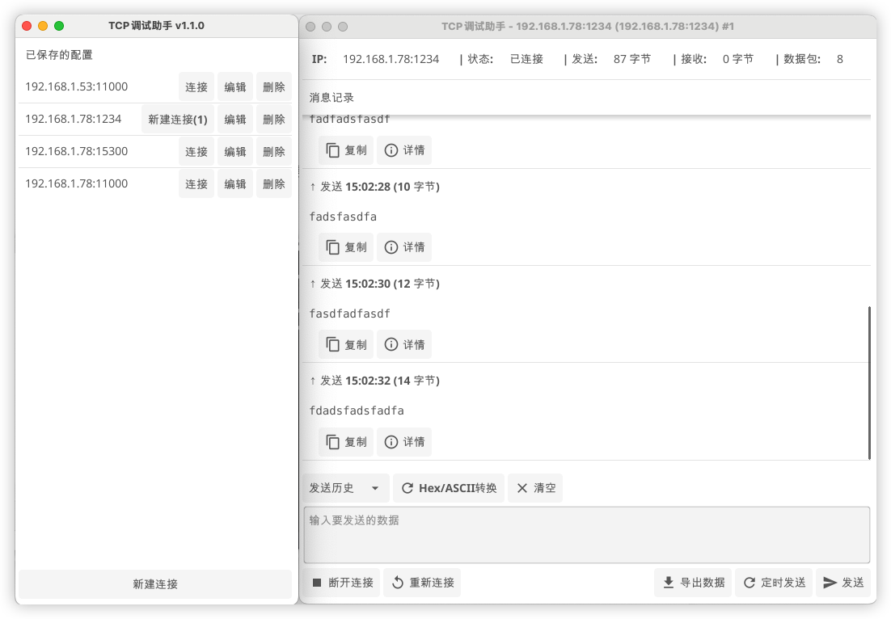
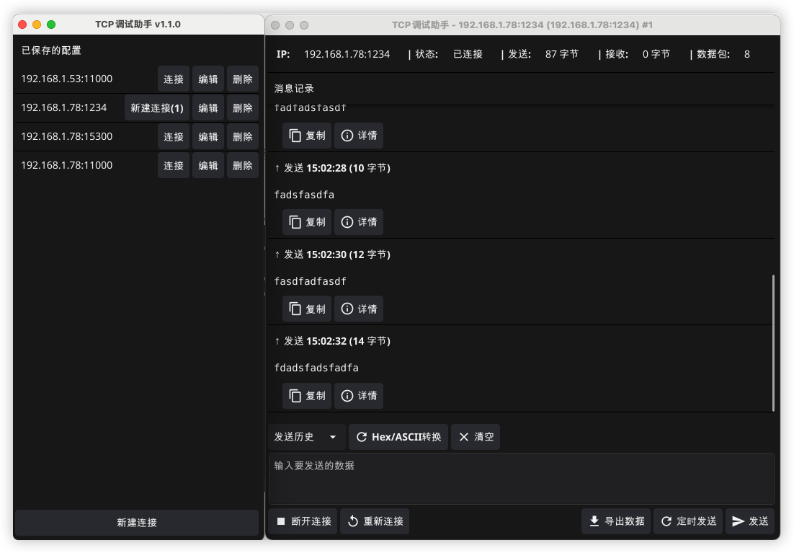

# TCP-Debug 功能简介

**TCP-Debug - 专业的TCP连接测试与调试工具**

## 软件概述

TCP-Debug 是一款专业的TCP连接测试与调试工具，提供直观的图形界面，帮助开发者快速建立TCP连接、发送接收数据、分析网络通信。

---

## 主要功能

### 🔌 TCP连接管理
- 多连接同时管理，每个连接独立窗口
- 连接配置自动保存，快速重连
- 实时连接状态监控
- 连接统计信息显示（IP、端口、发送/接收字节数、数据包数）

### 📤 数据收发
- **多格式支持**: HEX、ASCII、二进制、JSON
- **实时发送**: 快速发送数据包
- **发送历史**: 自动保存，支持重复发送
- **定时发送**: 支持定时自动发送功能

### 📥 数据接收与显示
- **双显示模式**:
  - **列表模式**: 显示时间戳、数据大小等详细信息
  - **追加模式**: 连续追加显示，支持文本选择和复制
- **消息详情**: 点击查看完整内容（ASCII/HEX格式）
- **一键复制**: 快速复制消息内容

### 🔧 粘包处理
- **长度前缀**: 数据包前N字节表示长度（1-8字节）
- **分隔符**: 使用指定分隔符拆分（支持常用分隔符快捷按钮）
- **固定长度**: 按固定字节数切分数据包

### ⚙️ 高级配置
- **连接超时**: 自定义超时时间（1-60秒）
- **自动重连**: 连接断开后自动重连
- **数据格式**: 发送和接收格式独立配置
- **性能优化**: 可调整UI刷新间隔、显示消息数、存储限制

### 🎨 界面定制
- **主题切换**: 深色/浅色主题，立即生效

*浅色主题界面*

*深色主题界面*

- **显示选项**: 自动换行、等宽字体、行号显示
- **性能监控**: 实时显示UI负载和内存使用

### 💾 数据管理
- **分层存储**: 热数据（内存）+ 冷数据（SQLite）
- **数据导出**: 支持导出消息记录
- **自动清理**: 智能管理存储空间

---

## 使用场景

- ✅ 网络协议开发与调试
- ✅ IoT设备通信测试
- ✅ 服务器端口检测
- ✅ 网络安全测试
- ✅ 硬件通信协议验证
- ✅ API和服务接口测试
- ✅ 网络教学与学习

---

## 平台支持

- **Windows**: x86、x64、ARM64
- **macOS**: Intel、Apple Silicon (M1/M2/M3)
- **Linux**: x86、x64、ARM64

---

## 快速开始

1. **创建连接**: 输入IP和端口，点击连接
2. **发送数据**: 在输入框输入数据，选择格式，点击发送
3. **查看接收**: 接收数据自动显示，支持列表和追加两种模式
4. **管理配置**: 在主窗口管理所有连接配置

---

**版本**: 1.2.0 | **官网**: https://tcp.onemoretry.cc

